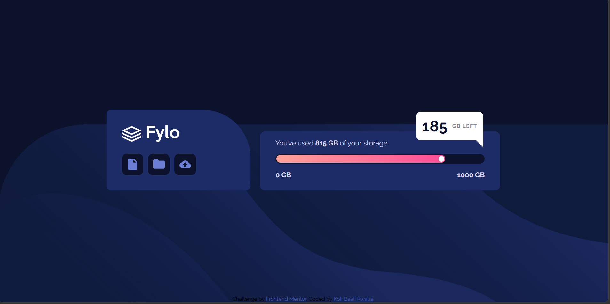

# Frontend Mentor - Fylo data storage component solution

This is my solution to the [Fylo data storage component challenge on Frontend Mentor](https://www.frontendmentor.io/challenges/fylo-data-storage-component-1dZPRbV5n). Frontend Mentor challenges help you improve your coding skills by building realistic projects.

## Table of contents

- [Overview](#overview)
  - [The challenge](#the-challenge)
  - [Screenshot](#screenshot)
  - [Links](#links)
- [My process](#my-process)
  - [Built with](#built-with)
  - [What I learned](#what-i-learned)
  - [Continued development](#continued-development)
  - [Useful resources](#useful-resources)
  - [AI Collaboration](#ai-collaboration)
- [Author](#author)

## Overview

### The challenge

Users should be able to:

- View the optimal layout for the site depending on their device's screen size

### Screenshot



### Links

- Solution URL: [Github](https://github.com/WesSno/Fylo-data-storage-component)
- Live Site URL: [Netlify](https://kbk-fylo-data-storage-component.netlify.app/)

## My process

### Built with

- Semantic HTML5 markup
- CSS custom properties
- Flexbox
- Mobile-first workflow

### What I learned

- Creating custom progress bars using HTML and CSS.

- see below:

```html
<div class="progress-bar">
  <div class="progress-fill">
    <span class="progress-dot"></span>
  </div>
</div>
```

```css
.progress-bar {
  width: 100%;
  height: 20px;
  background: hsl(229, 57%, 11%);
  border-radius: 50px;
  padding: 2px;
}

.progress-fill {
  width: 81.5%;
  height: 100%;
  background: linear-gradient(to right, hsl(6, 100%, 80%), hsl(335, 100%, 65%));
  border-radius: 50px;
  position: relative;
}

.progress-dot {
  width: 12px;
  height: 12px;
  background-color: white;
  border-radius: 50%;
  position: absolute;
  top: 50%;
  right: 2px;
  transform: translateY(-50%);
}
```

- Creating tooltip pointers using CSS pseudo-elements and borders.
  - see below:

```css
.storage-left::after {
  content: "";
  position: absolute;
  right: 0;
  bottom: -15px;
  width: 0;
  height: 0;
  border-left: 25px solid transparent;
  border-top: 25px solid white;
}
```

- Using gradients and border-radius properties to replicate modern UI designs.
- Positioning elements with relative and absolute positioning.
- Building reusable UI components with shared CSS classes.
- Applying Flexbox for alignment and spacing.
- Implementing responsive design adjustments using media queries.
- Translating a design mockup into a functional web interface.

### Continued development

- Convert the static progress bar into a dynamic component driven by data.
- Add smooth width transition animations to the progress indicator.
- Animate the progress dot as storage values change.
- Fetch storage usage values from JavaScript instead of hardcoding them.
- Improve accessibility by adding ARIA progress attributes.
- Create reusable progress bar components for different storage plans.

### Useful resources

- [Frontend Mentor](https://www.example.com) - provided me with the necessary resource to complete this project.

### AI Collaboration

ChatGPT was used as a learning and problem-solving assistant throughout the development of this project. Rather than generating the entire solution, ChatGPT helped explain concepts, troubleshoot issues, and suggest implementation approaches that I then adapted and applied myself.

Key areas where ChatGPT assisted include:

- Understanding the structure and styling of a static progress bar.
- Learning how to create a tooltip-style storage indicator with a CSS-generated arrow using pseudo-elements.
- Troubleshooting inconsistent icon container sizing and improving component consistency.
- Improving code organization through reusable CSS classes and cleaner HTML structure.
- Providing feedback on project documentation and README content.

## Author

- Website - [Kofi Baafi Kwatia](https://github.com/WesSno)
- Frontend Mentor - [@WesSno](https://www.frontendmentor.io/profile/WesSno)
